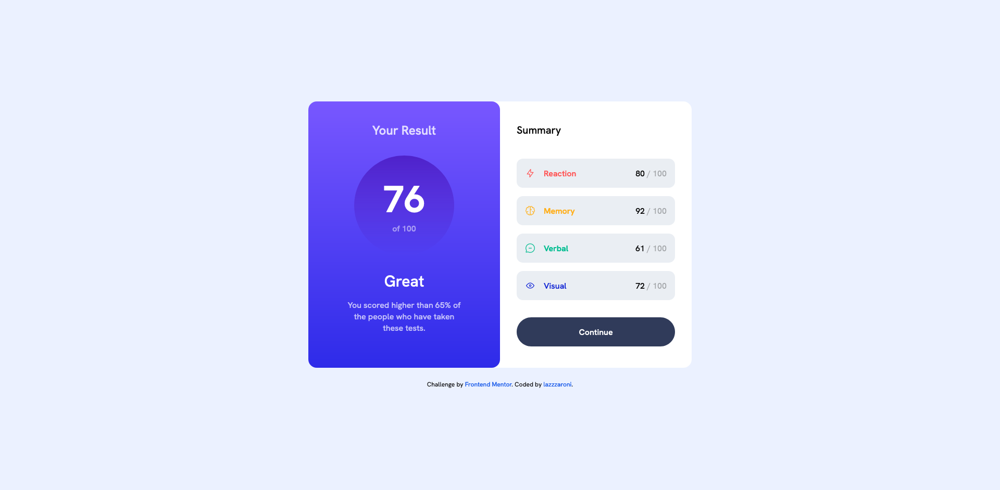

# Frontend Mentor - Results summary component solution

This is a solution to the [Results summary component challenge on Frontend Mentor](https://www.frontendmentor.io/challenges/results-summary-component-CE_K6s0maV). Frontend Mentor challenges help you improve your coding skills by building realistic projects.

## Table of contents

- [Frontend Mentor - Results summary component solution](#frontend-mentor---results-summary-component-solution)
  - [Table of contents](#table-of-contents)
  - [Overview](#overview)
    - [The challenge](#the-challenge)
    - [Screenshot](#screenshot)
    - [Links](#links)
  - [My process](#my-process)
    - [Built with](#built-with)
    - [What I learned](#what-i-learned)
    - [Continued development](#continued-development)
    - [Useful resources](#useful-resources)
  - [Author](#author)

## Overview

### The challenge

Users should be able to:

- View the optimal layout for the interface depending on their device's screen size
- See hover and focus states for all interactive elements on the page

### Screenshot




### Links

- Solution URL: [GitHub Repo](https://github.com/lazzzaroni/results-summary-component)
- Live Site URL: [GitHub Pages](https://lazzzaroni.github.io/results-summary-component)

## My process

### Built with

- [React](https://reactjs.org/) - JS library
- [Next.js](https://nextjs.org/) - React framework
- [Tailwind CSS](https://tailwindcss.com/) - For styles

### What I learned

- Adding custom fonts to Nextjs project
- Setting custom parameters in Tailwind classes (inline and through config)
- Displaying data with `map()`
- CallbackFn in reducer function can mutate initial data => showing incorrect data

```js
// that will mutate `entry.score` in `data` array
const result = Math.floor(
  data.reduce((acc, entry) => (entry.score += acc), 0) / data.length
);
```

```js
// the way I fix this behavior
const result = Math.floor(
  data.reduce((acc, entry) => {
    const score = entry.score + acc;
    return score;
  }, 0) / data.length
);
```

### Continued development

I'm still not fully comfortable with Tailwind, so I'll continue learning it.

### Useful resources

- [Array.prototype.reduce() - JavaScript | MDN](https://developer.mozilla.org/en-US/docs/Web/JavaScript/Reference/Global_Objects/Array/reduce) - This helped me for fix unwanted behavior in my reducer function.

## Author

- Website - [mpaliakou.dev](https://mpaliakou.dev)
- Frontend Mentor - [@lazzzaroni](https://www.frontendmentor.io/profile/lazzzaroni)
